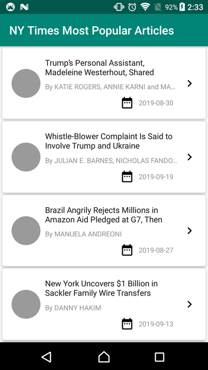

## NY Times Most Popular Articles

## Project Description

Build a simple app to hit the NY Times Most Popular Articles API and show a list of articles, that shows details when items on the list are tapped (a typical master/detail app).

## MVP

The MVP is a very limited initial version of the Charity Dapp. The goal is to create the bare minimum that is needed to start funding projects, it will not be until Phase 2 and 3 where utility will come into the system (being able to fund and unfund milestone based smart contracts and allowing the Donors to give the project they are funding feedback). The MVP will be completely centralized, will desperately need a UI and will not have many advantages to currently running projects like GoFundMe, but it will evolve from here, this is still the early stages, the actual development only started in late October!

### Used libraries: ###
- [Retrofit2](https://github.com/square/retrofit)
- [RxJava2](https://github.com/ReactiveX/RxJava)
- [RxAndroid](https://github.com/ReactiveX/RxAndroid)
- [Butterknife](https://github.com/JakeWharton/butterknife)

### References: ###
- [ِAndroid Documentation](https://developer.android.com/topic/libraries/architecture)
- [source code for the official Google I/O 2018 for Android app](https://android-developers.googleblog.com/2018/08/google-releases-source-for-google-io.html)
- [Architecture Components Code Lab](https://codelabs.developers.google.com/codelabs/build-app-with-arch-components/index.html?index=..%2F..%2Findex#0)

### License: ###
~~~~
Copyright 2019 Amr Abdelhameed

Licensed under the Apache License, Version 2.0 (the "License");
you may not use this file except in compliance with the License.
You may obtain a copy of the License at

   http://www.apache.org/licenses/LICENSE-2.0

Unless required by applicable law or agreed to in writing, software
distributed under the License is distributed on an "AS IS" BASIS,
WITHOUT WARRANTIES OR CONDITIONS OF ANY KIND, either express or implied.
See the License for the specific language governing permissions and
limitations under the License.
~~~~
