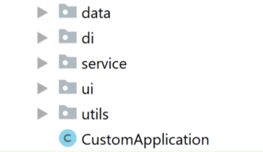
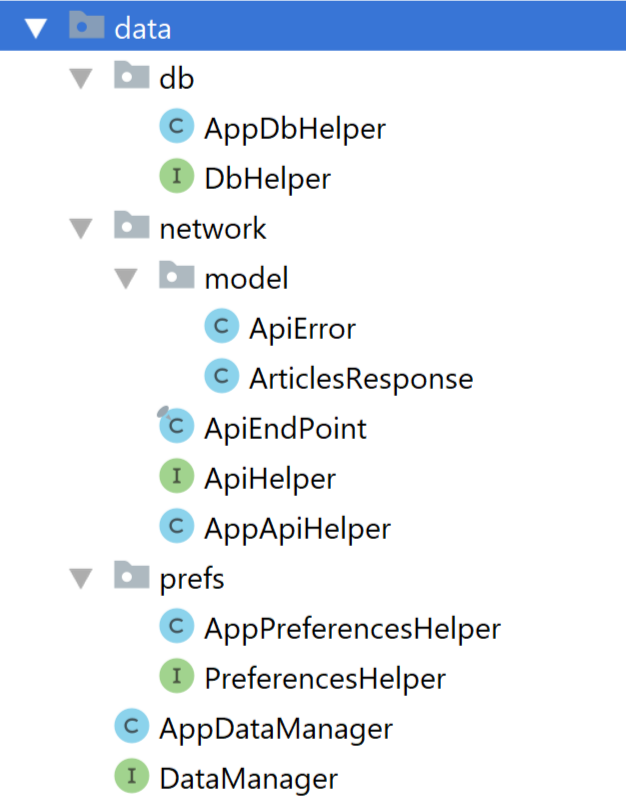
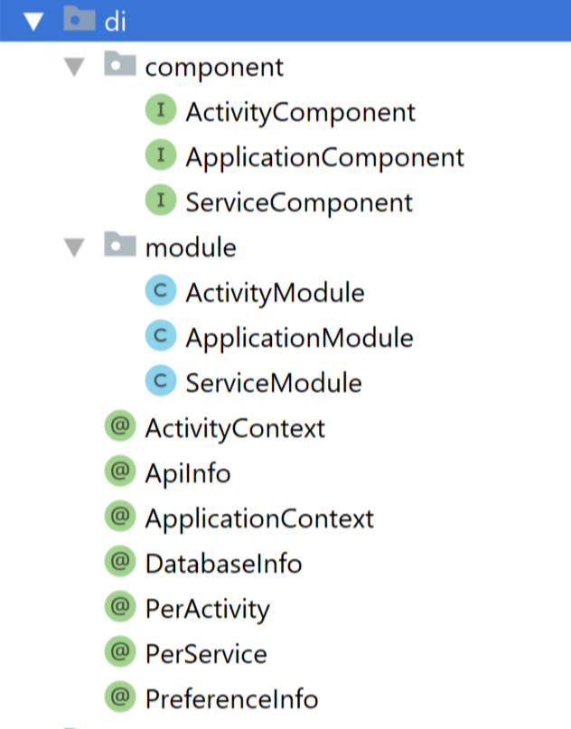
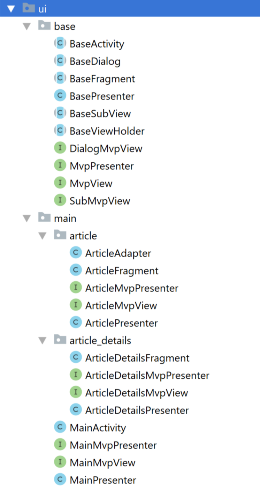

# NYTimesMostPopularArticles-MVP

This repository contains a simple app to hit the NY Times Most Popular Articles API and show a list of articles, that shows details when items on the list are tapped (a typical master/detail app) that implements MVP architecture using Dagger2, RxJava2, FastAndroidNetworking and Butterknife
<br>
<p align="center">
    
    
</p>
<br>
<br>

# Architecture Blueprint

<br>

# Project Structure
<p align="center">
    
    
    
</p>
<br>
<p align="center">
    
    
    
</p>
<br>

#### The app has following packages:
1. **data**: It contains all the data accessing and manipulating components.
2. **di**: Dependency providing classes using Dagger2.
3. **ui**: View classes along with their corresponding Presenters.
4. **service**: Services for the application.
5. **utils**: Utility classes.

#### Classes have been designed in such a way that it could be inherited and maximize the code reuse.

### Library reference resources:
1. RxJava2: https://github.com/ReactiveX/RxJava
2. RxAndroid: https://github.com/ReactiveX/RxAndroid
3. Dagger2: https://github.com/MindorksOpenSource/android-dagger2-example
4. FastAndroidNetworking: https://github.com/amitshekhariitbhu/Fast-Android-Networking
5. ButterKnife: http://jakewharton.github.io/butterknife/

### License
```
   Copyright (C) 2019 Amr Abdelhameed

   Licensed under the Apache License, Version 2.0 (the "License");
   you may not use this file except in compliance with the License.
   You may obtain a copy of the License at

       http://www.apache.org/licenses/LICENSE-2.0

   Unless required by applicable law or agreed to in writing, software
   distributed under the License is distributed on an "AS IS" BASIS,
   WITHOUT WARRANTIES OR CONDITIONS OF ANY KIND, either express or implied.
   See the License for the specific language governing permissions and
   limitations under the License.
```